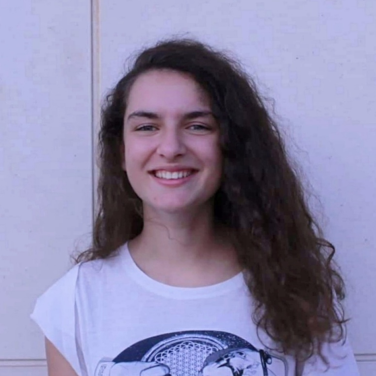

# PL2024

## Introdução
Repositório com os conteúdos da UC de Processamento de Linguagens da Universidade do Minho no ano letivo 2023/2024.

## Aluno

- **Nome:** Marta Sofia Matos Castela Queirós Gonçalves
- **ID:** A100593
- **Foto:** 